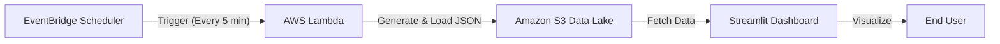

# AWS Serverless Data Pipeline & Analytics Dashboard


**A cloud-native, serverless ETL pipeline that automates real-time sales data generation, ingestion, and visualization.**

### 🔴 Live Demo
**[Click here to view the Live Dashboard](https://aws-serverless-data-pipeline.streamlit.app)**

*(Note: If the app is asleep, please allow 30-60 seconds for the container to wake up.)*

---

## 🚀 Project Overview

The objective of this project was to architect a scalable data pipeline that simulates real-time transaction processing. The system automatically generates synthetic sales records, stores them in a data lake, and provides immediate business intelligence insights through a custom dashboard.


### Key Features
* **Fully Automated:** No manual intervention required. Data is generated and ingested automatically via **Amazon EventBridge** triggers.
* **Serverless Ingestion:** Uses **AWS Lambda** to generate and process data without provisioning servers.
* **Scalable Storage:** Leverages **Amazon S3** as a durable Data Lake for JSON documents.
* **Real-Time Analytics:** Features a cloud-deployed **Streamlit** dashboard for instant KPI visualization.
* **Infrastructure as Code:** Uses Python `boto3` for programmatic interaction with AWS services.

---

## 🏗️ Architecture

This project moves away from traditional server-based architectures to a fully **Event-Driven Serverless** model.



1. **Orchestration (Amazon EventBridge):** Acts as the cron scheduler, triggering the data generation event every 5 minutes to simulate a live production environment.
2. **Computer (AWS Lambda):** A Python-based serverless function that generates synthetic transaction records (Sales, Quantity, Product Category).
3. **Storage (Amazon S3):** Acts as a durable Data Lake, storing raw JSON ingestion files.
4. **Visualization (Streamlit):** A cloud-deployed Python application that ingests data from S3, performs transformation (Pandas), and renders real-time KPIs.

---

## 🛠️ Prerequisites

Before running this project, ensure you have the following:

* **AWS Account:** Access to the AWS Console (Free Tier is sufficient).
* **Python 3.10+:** Installed on your local machine.
* **AWS CLI:** Installed and configured with valid IAM credentials.

---

## ⚙️ Setup & Installation
### 1. Clone the Repository
```bash
git clone https://github.com/shivamgravity/aws-serverless-data-pipeline
cd aws-serverless-data-pipeline
```
### 2. Setup Virtual Environment
It is recommended to use a virtual environment to manage dependencies.
``` bash
# Create venv
python -m venv venv

# Activate venv (Windows)
venv\Scripts\activate

# Activate venv (Mac/Linux)
source venv/bin/activate
```
### 3. Install Dependencies
```bash
pip install -r requirements.txt
```
*(Dependencies include: streamlit, boto3, pandas, matplotlib, seaborn, python-dotenv)*

### 4. Configure AWS Credentials
To allow the local dashboard to read from S3, rename the template file and add your keys:
1. Rename `.env.example` to `.env` or create a new `.env` file.
2. Add your credentials:
```bash
AWS_ACCESS_KEY_ID=your_access_key
AWS_SECRET_ACCESS_KEY=your_secret_key
AWS_DEFAULT_REGION=your_s3_bucket_region
AWS_S3_BUCKET_NAME=your_s3_bucket_name
```
*(Note: For Cloud deployment, use Streamlit Secrets instead of .env)*

## How to Run
### Step 1: Data Generation (Automated)
The pipeline is automated via **Amazon EventBridge**.
* Navigate to **AWS Lambda** > Functions > `GenerateSalesData`.
* Verify that the EventBridge trigger is active (e.g., set to run every 5 minutes).
* *Verification*: Check your **S3 Bucket** to see new `.json` files appearing automatically.

### Step 2: Launch Dashboard
**Option A: Run Locally** Run the streamlit application from your terminal:
Run the streamlit application from your terminal:
```bash
streamlit run dashboard.py
```
The dashboard will open at `http://localhost:8501`.

**Option B: Create Live Cloud Deployment** on <u>streamlit cloud</u>.

## Source Code Guide
* `lambda_function.py`: The logic deployed to AWS Lambda. It uses the `random` library to simulate sales and `boto3` to write to S3.
* `dashboard.py`: The main application file. It handles the S3 connection, data parsing, and UI rendering using Streamlit and Matplotlib. It automatically detects if it is running locally or on the cloud.
* `requirements.txt`: List of Python libraries required to run the dashboard.

## Troubleshooting
* **"No Data Found":** Ensure you have run the Lambda function at least once. Check your S3 bucket permissions.
* **"Access Denied" Error:** This usually means your local AWS credentials are missing or incorrect. Re-run `aws configure` or check your `.env` file.
* **"Module Not Found":** Ensure you activated your virtual environment before running `streamlit run`.

## Future Roadmap
* **Integration:** Add AWS Glue for schema inference and cataloging.
* **Querying:** Implement Amazon Athena to run SQL queries directly on S3 JSON data.
* **Alerting:** Configure SNS (Simple Notification Service) to alert on unusually high-value transactions.